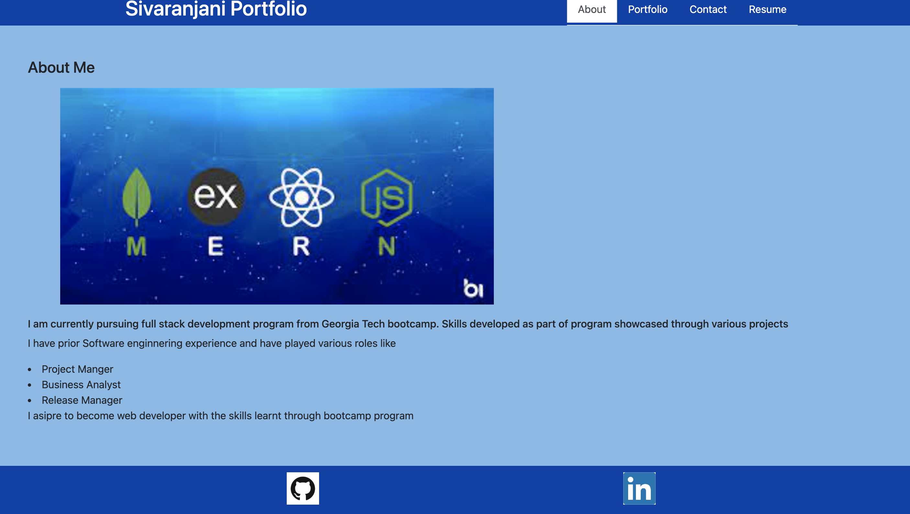
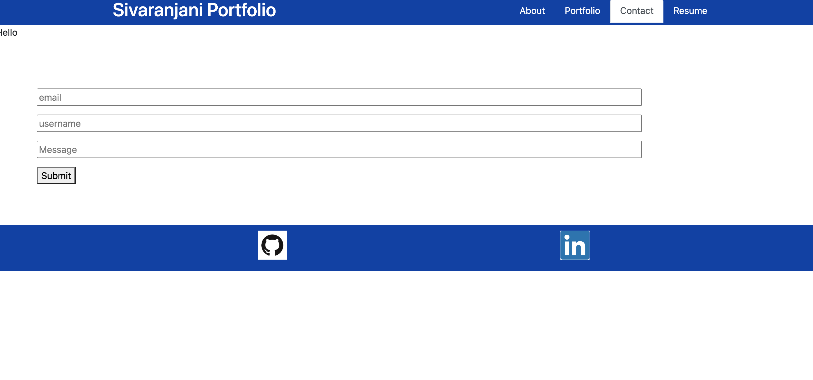
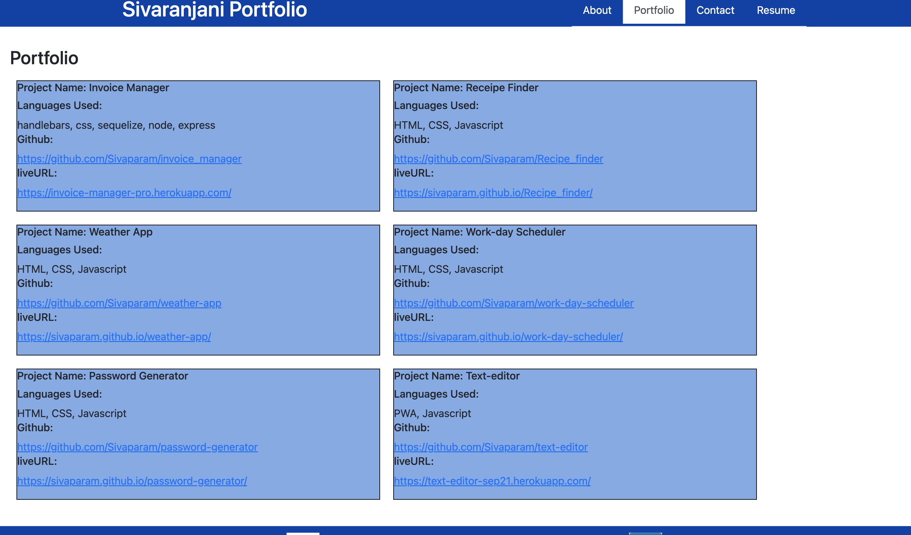
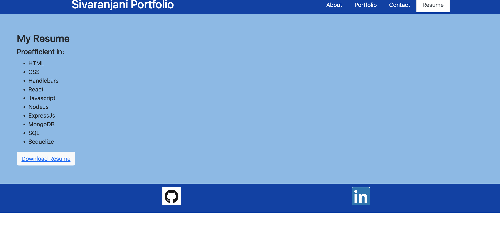

# My Portfolio

## Description
* As an employer looking for candidates with experience building single-page applications, to view a potential employee's depolyed React Portfolio of work samples
so that employer could assess whether they are a good candidate for an open position.

## Table to contents

-[Description](#description)

-[Acceptance Criteria](#acceptance-criteria)

-[Installation Steps](#installation-steps)

-[Mock-up Screen](#mock-up-screen)

## Acceptance-criteria
* Given a single-page application portfolio for a web developer:
* WHEN user loads application, THEN user is presented with a page containing a header, a section for content and a footer
* WHEN user views the header,THEN user is presented with the developer's name and navigation with titles corresponding to different sections of the portfolio
* WHEN user views the navigation titles, THEN user is presented with the titles About Me, Portfolio, Contact, and Resume, and the title corresponding to the current section is highlighted
* WHEN user clicks on a navigation title, THEN user is presented with the corresponding section below the navigation without the page reloading and that title is highlighted
* WHEN user loads the portfolio the first time, THEN the About Me title and section are selected by default
* WHEN user is presented with the About Me section, THEN user sees a recent photo or avatar of the developer and a short bio about them
* WHEN user is presented with the Portfolio section, THEN user sees titled images of six of the developer’s applications with links to both the deployed applications and the corresponding GitHub repository
* WHEN user is presented with the Contact section, THEN user sees a contact form with fields for a name, an email address, and a message
* WHEN user moves my cursor out of one of the form fields without entering text, THEN user receives a notification that this field is required
* WHEN user enters text into the email address field, THEN user receives a notification if user have entered an invalid email address
* WHEN user is presented with the Resume section, THEN user sees a link to a downloadable resume and a list of the developer’s proficiencies
* WHEN user views the footer, THEN user is presented with text or icon links to the developer’s GitHub and LinkedIn profiles.

## Installation steps

* install the following:
npm init ,
npm install express,
npm install react
mpm install react-dom
npm install bootstrap

* To invoke, in terminal give command - npm start

## Mock-up screen

### Github URL: 
https://github.com/Sivaparam/my-portfolio

### Live URL: 

